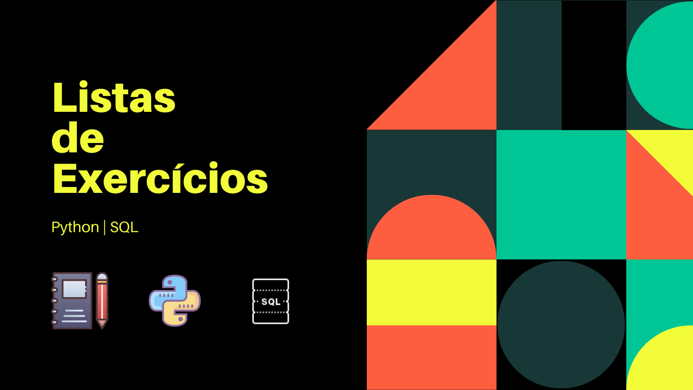

# Caderno de exercícios

Repositório com notebooks de listas de exercícios que tenho feito para praticar.

Listas com todos os exercícios desse repositório:  
[Python Brasil - Estrutura sequencial](https://wiki.python.org.br/EstruturaSequencial)  
[Python Brasil - Estrutura de decisão](https://wiki.python.org.br/EstruturaDeDecisao)  
[Python Brasil - Estrutura de repetição](https://wiki.python.org.br/EstruturaDeDecisao)  